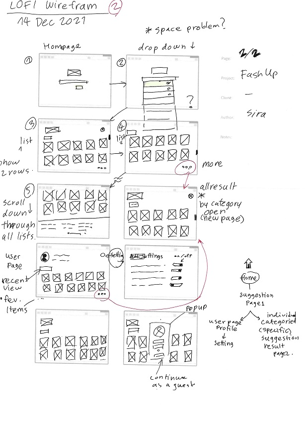
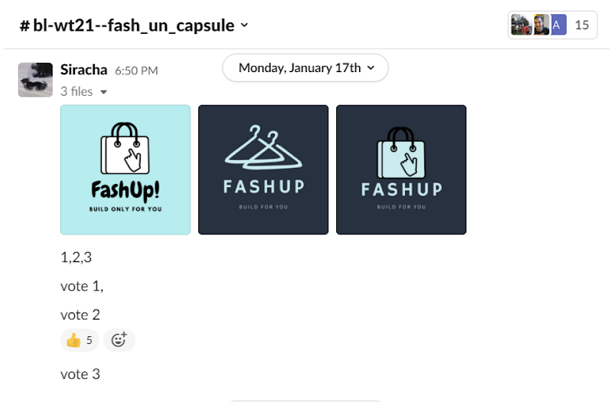
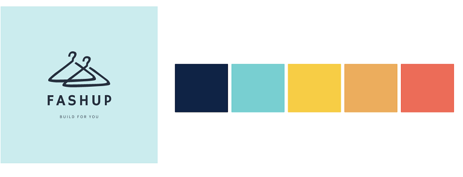
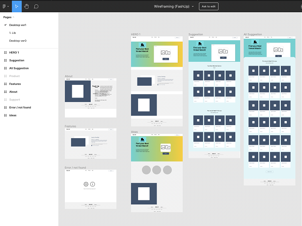
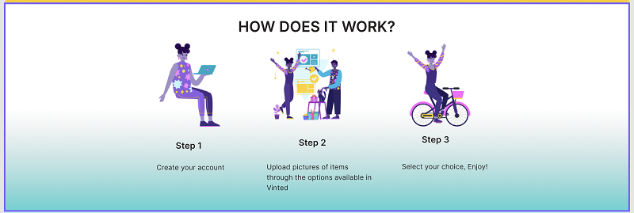
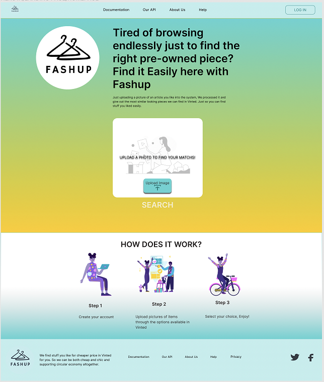
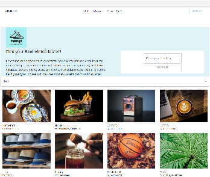
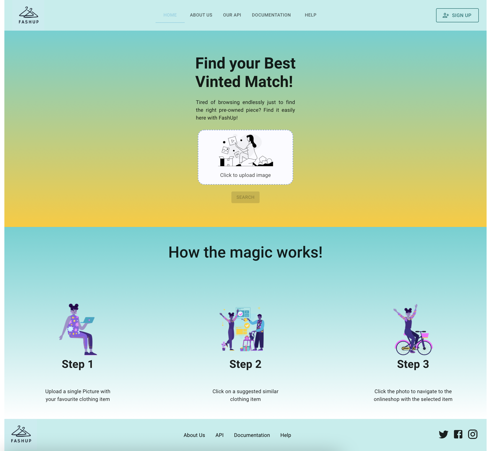
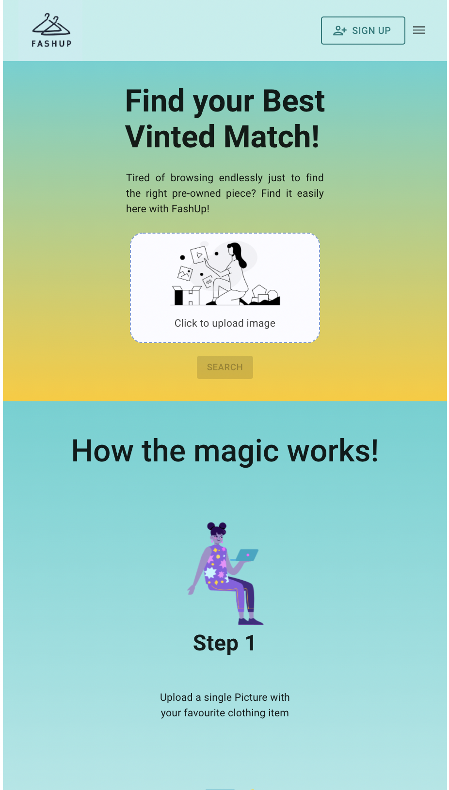

# Abstract

Our team developed a solution that allows the users to upload a picture of their desired clothing item and to quickly find the most similar and personalised second hand item on the platform vinted.com.

# Project Summary

### Organising the Work

At the beginning of the project, the team consisted of 3 UX designers, 2 Web Developers (WD) and 3 Artificial Intelligence members (AI). During the course of the project phase the team had to deal with three dropouts, which gladly were not critical for our work. Only three (2 Web Developers and 1 AI member) of the five-member team had gotten to know each other superficially during the theory phase at the TechLabs GitHub Workshop. All other members were complete strangers to each other. Everyone also learned completely new material and gained new knowledge.

Hence the first challenge of the project already became apparent. We had to organise ourselves without knowing the strengths/weaknesses of each other. Nor did we know the working style or anything about the individual character of each member. We also were not able to estimate our individual level of knowledge for this kind of project scope, where we had to put theory immediately into practice in a short amount of time. So the first two weeks of the project phase were characterised by uncertainty and lack of clarity. We didn’t know where to start. How should we bring the different tracks together? Are the different tracks able to apply the new and huge amount of knowledge? And are we then able to bring everything together as a cross functional team?

During the first two weeks the need for a project manager became more and more noticeable, even though no one formulated this explicitly. The task of the project manager was to work out the overall view of the upcoming tasks, the priorities and the time schedule and to make it transparent for all tracks. This task was taken over by a member of the WD team and he was accepted by team members in his role. There was no official vote, instead it evolved naturally through the project phase.

We agreed very quickly on a weekly Jour Fixe, where each track regularly presented an update on the current work of the respective team and hence we tried to establish fixed working structures. For further communication, we used Slack. Both structural elements were sufficient for us throughout the project and helped us coordinate our work. As another tool for work organisation, we used the virtual board Miro. This is where we recorded our minutes for the weekly Jour Fixe. As the project progressed, the other most important work tool was the Kanban board, where each team recorded the tasks to be completed. Our decision to use the Kanban board was based on the realisation that for our agile and incremental way of working, traditional project plans or timelines were blocking our progress rather than helping. This was because we had to constantly re-evaluate and adjust our MVP features and tasks in order to bring the project to a successful conclusion.

Our greatest success in this area is that we came together as strangers and grew together as a team that supported each other despite all adversities and challenges. We also learned to be flexible, make decisions quickly, and adapt instantly to any change, which made us resilient as a team. In certain situations our project mentor was very helpful and supported us because he pointed us in the right direction when we needed guidance or advice.

### Problem Identification

The original project problem arised due to the fact that vinted.com and second hand websites in general do not offer personalized clothing suggestions when shopping online. After an intense brainstorming session with our team, we identified three additional problems within the second hand online shopping market:

1. No Personalized Suggestions
2. Fragmented Supply
3. Time Consuming Second Hand Shopping
4. Inflated Prices

But before we started creating a product matching these problems, we tried to better understand the market we aimed to penetrate as well as its consumers. Therefore we conducted both, market research as well as user surveys. And luckily, the results of both analysis were consistent. They showed that 1) there seems to be an increasing trend towards second hand hand shopping and 2), the second hand market is predicted to grow from $30bn to $80bn in the next five years. So this shows that there is indeed both 1) a consumer need as well as 2) promising market growth wherefore we decided to develop our FashUp plattform. But how to align all four problems and form a solution? A computer vision model of course! **The ultimate goal was to find a solution that allows end-users to upload his/her favorite clothing item and to quickly find the most personalized secondhand item.**

For implementation purposes, we divided the project into three main blocks:

1. UX/UI: Validating Problem and building design
2. Web Development: Creating a Website
3. Artificial Intelligence: Building the MVP functionality

### Understanding the user: UX User Research

Understanding the user is the first step in the UX Design process, which many sources refer to in different ways. In this step, we try to understand the user for whom we will build this service, and we try to access the logic behind their decisions. This includes user research, persona creation and user story creation.

We had a total of 33 participants for our study, which is not a great number, but given the time frame, it was enough to give us insight into the general online shopping group's preferences and early views. We designed a simple Google form to share the questions with the wider audience. From the beginning of the winter break until the fourth week before the midterm, we worked on it. It clarified things for us and allowed us to go forward with our endeavour. The important findings from our online survey are summarised below. The format and specifics of our online survey may be seen in the FashUp Report's UX directory.

The most interesting finding of our online survey was that our target group values a good price and a desire for long-term sustainability. Major market research came to the same result as we did, predicting a market rise of 30 billion to 80 billion dollars over the next five years, or a 15% to 20% increase per year.

**User Story**

Based on our research we created two user Stories, which describes our average user.

    

**Wireframe and User Flow**

We began with hand-drawn primitive wireframing and another layout to give the WD team a basic notion of how the website would appear, simply to give them a general idea. This allowed them to work on their coding and set up their own structure.

    
    

While the WD Team began exploring the programming required for the website project based on the wireframe, UX began working on additional details such as design, user flow and application possibilities.

    
    

**Logo**

The website's little features, such as service names, a logo created with Canva and colour themes from MuzIi colour, were all determined by team voting.

    
    

    

**Mockup Prototype**

We created a short mockup prototype using MUI and the Figma Wireframing tool to better visualize the eventual website. This made working with the WD team easier because the mock-up prototype could be used to test the Figma and frontend integration early on. We were working with the WD team to figure out how to extract the CSS code out of Figma and offered the WD access to the files and other information they might need.

    

**Making of the prototype**

We progressed from creating a wireframe prototype to creating a completely functional prototype. This involved setting up the system for use by creating each page, and each component had to be designed and prepared ahead of time to be included into the prototype. This distinguished the prototype from the previous mock-up prototype.

We began by constructing each constituent in whatever manner that might be useful in our situation. Color, Typography, Icons, Buttons, Checkboxes, Dropdown menu, Tags, Page indicators-Pagination, Input field, Tabs, Toggles, Different types of Forms, Header, Footer, Hero banner, Body banner, User bar, Cards, Progress bar, and others are just a few examples of minor elements.

    

Then we started putting things together using all of the elements that were now in our assets. Then we added some spice to it by using plugins like Blush and Unsplash to add some photographs and graphics to our website. One such example can be found in our banner.

    

**Example pages from prototype: Hero page and additional pages**

    
    

### Web Development: Creating the website

**Techstack**

For both of us it was clear from the beginning that we wanted to use the JavaScript library React for our project to program the user interface (UI). After all, we had learned React as part of the curriculum at TechLabs and now we wanted to apply it in practice. As one of the most and widely used frontend technologies in the industry, it was important for us to practice our developer skills using React. With this decision, node.js was added to our tech stack as a server development environment. To be able to develop and modify a prototype as fast as possible, we decided to use Material UI (MUI), a React component library, with which we had no experience so far.

**Coding the web app**

Without a design template from the user experience (UX) team, there didn't seem to be much for us to do at first. However, we knew that we couldn't wait for a design from UX before we started programming. We agreed that we would prepare as much as possible without UX's design input. After internal discussions and consultation with our project mentor, our first step was to set up our development environment with npx create-react-app and push it to GitHub.

In addition to the classic areas of a website such as header, main and footer, we had to identify and program functionalities to be ready to work early without a concrete design prototype. Based on the idea of what our Minimum Viable Product (MVP) functionality could be, we derived the necessary components for the web app to be programmed. In the process, we simultaneously dived into the React component library MUI. Here is an example of our first attempts. For our MVP, for example, the user had to be able to upload a photo and send it to the AI model. To do this, we started by programming a simple input field with a button. At this point, we assumed that we needed a search field where the user enters a URL.

    
    

Besides a search function, we knew that the results from the AI model should also be displayed in the frontend. Without design sketches, we programmed pure functionalities without styling. For example, we added an image list, which should display the user query and the subsequent response of the AI model with suggestions in a result list as output in the frontend.

    

After the first design drafts came from UX, we continued programming the website and adding the designs accordingly. The design of the website has continuously evolved and we as developers had to react quickly and flexibly and adjust everything accordingly.

    
    

It was only two weeks before the end of the project that we found out that we were not using a search field that sends a URL to the AI model. Instead, we had to include a file upload functionality where the user picks a photo from his computer and gets a preview of the provided file. This requirement posed a challenge to us as prospective developers, as we had not learned anything in this direction before. First we decided to try a popular drag and drop solution for MUI, that comes from a third party and is known as Dropzone. However, we were not satisfied with Dropzone's solution. Through thorough research and learning-by-doing, we developed a simpler solution that also works on mobile devices by clicking on the upload area and choosing a file through the explorer window. In the meantime, we had also made the website responsive for mobile devices.

    
    
    

For testing purposes, we had rebuilt a backend server in our development environment in a very simple form and tried to connect it to the frontend. This was working very well in our simplified test run. However, the connection of the FE to the BE of the AI team was more difficult. In the BE itself, there were request errors that the AI team had to overcome in order to accept and process the data coming from the FE. On the other hand, AI had to make sure to provide the results of their model in a way that it was compatible with the frontend. For example, when transferring data from the BE to the FE, the data had to be passed in a JSON format so that we could extract the necessary information in the FE using a mapping function and allocating the data to its correct position in our Image List. However, due to syntax errors, this did not work smoothly and we had some struggle to find a working solution and to adjust the code accordingly. These are just a few examples of the challenges we overcame together as a team with WD and AI. The result is a working user query and the display of the AI model results in the FE.

**Cross Functional Teamwork with UX and AI**

During the entire project phase, we continuously consulted with UX and worked very closely together. Until shortly before the end of the project, we made a lot of different adjustments with the website structure and layout. We had to be flexible and agree with UX which design was technologically feasible and could be implemented quickly.

There was a constant flow of information between the WD and AI team and we discussed a lot. This was also necessary because the connection of the FE to the AI model was one of the biggest challenges. At the beginning, neither side had a clear idea of how the other's technologies worked and how the FE could be connected to the AI Model. We only had a rough and loose idea. At this point, we enlisted the help of our project mentor who gave us some guidance and pointed us in the right direction.

### Artificial Intelligence: Building the MVP functionality

From a technological-AI perspective, the ultimate project goal meant to solve a similarity recommendation problem, which should function in the following way:

For building such MVP functionality, the AI team divided the problem into the following three steps:

1. **Input** - Collecting data for both, the user picture as well as the benchmark dataset
2. **Intelligently calculate vectors** - Finding suitable AI model that labels pictures with vectors
3. **Output** - Finding an algorithm that calculates the distance between vectors and recommends the pictures with the closest distance

**1. Input**

Since the user picture will be provided by the end user itself (via the frontend), we needed to only find a suitable benchmark dataset. The benchmark database represented the universe out of which the user gets displayed similar pictures. For our MVP, we relied on data from the second hand website vinted.com and hence scraped in total 3000 pictures via their official API. (Future Outlook: dataset to be enlarged by data of more second hand platforms)

**2. Intelligently calculate vecors**

During our search for a suitable AI model that is capable of labeling pictures with vectors, we came across the [DocArray library](https://github.com/jina-ai/docarray), which allows deep-learning engineers to efficiently process, embed, search, recommend, store, and transfer the data with a Pythonic API. The library offers exactly the vector labeling functionality we were searching for. The only variable it requires is the model itself, for which we assumed the Resnet50 to be accurate in the first place (Future Outlook: Resnet50 to be re-trained on DeepFashion database to increase accuracy).

**3. Output**

The DocArray library seems also capable of determining similarity between pictures, wherefore no further algorithm research needed to be conducted.
Finally, putting all chunks together, we successfully received a recommendation of matching comparable fashion items for a given user fashion picture.
